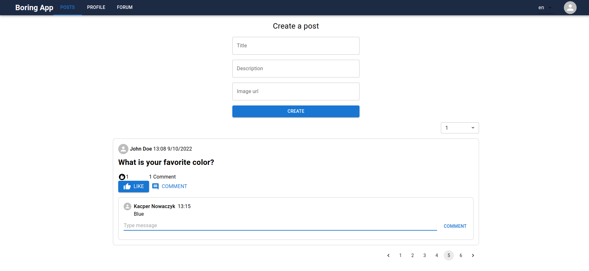
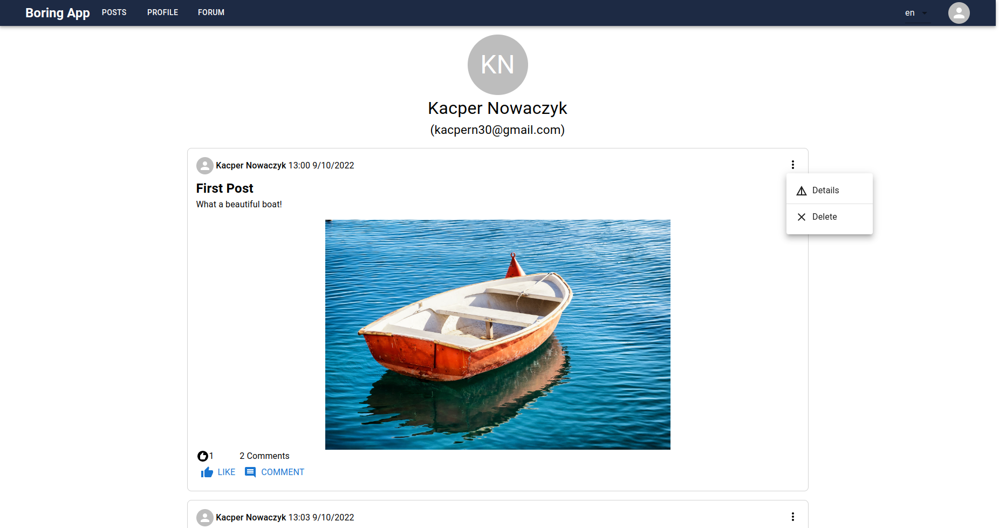
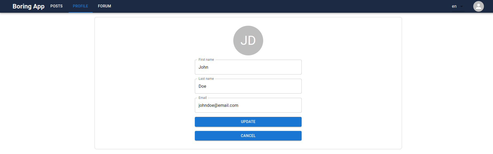
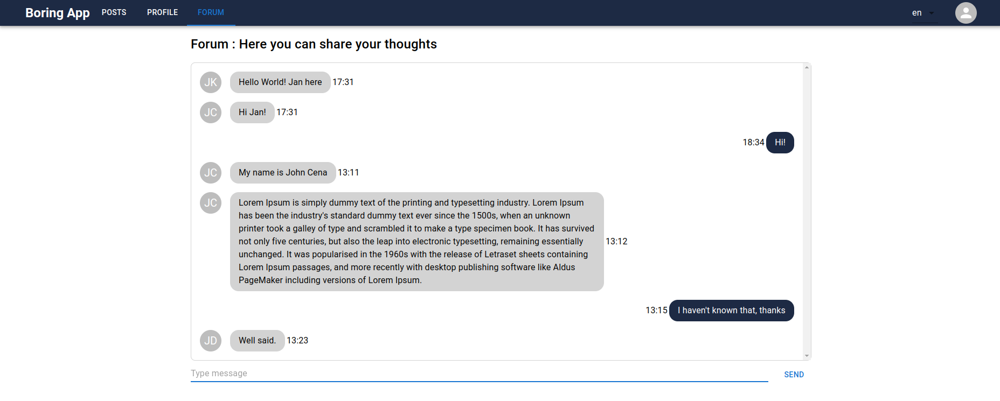
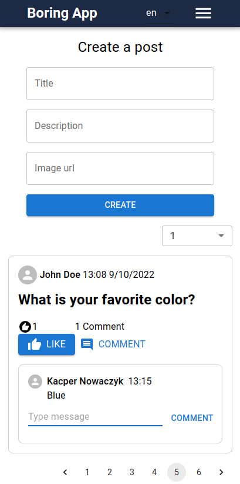

# Boring-app
Basic fullstack multilanguage social media app.

## Technologies
- ReactJS
- Typescript
- MUI
- i18next
- Zustand
- Express
- GraphQL
- Mongoose
- Websockets

## Modules
### Wall
Section dedicated to creating posts and sharing images. Here you can like or comment peoples' posts as well as navigate
to user/post details pages by clicking user name or title of a post.

### Profile
Section dedicated to checking and modifying your personal data.

### Forum
Section dedicated to sharing thoughts. It includes chat that is built on websockets.

### Mobile
Responsive design.

